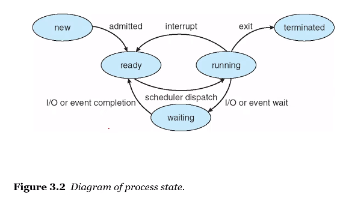
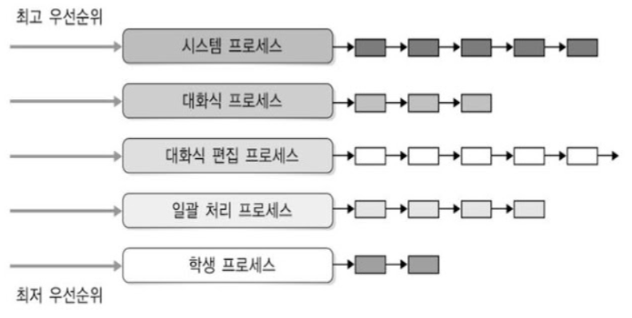

스케줄링은 무엇이고 필요한 이유가 무엇인가요 ?

- CPU 스케줄링은 프로세스가 작업을 수행할 때, 언제 어떤 프로세스에 CPU를 할당할지를 결정하는 작업이다.
- 멀티 스레드 환경, 즉 시분할 환경에서 한정된 CPU 및 I/O장치 등의 시스템 자원을 가지고 최고의 성능을 내야 하고, 따라서 자원을 언제 어떻게 할당할지를 결정해야하기 때문에 필요하다. 

프로세스의 생명주기에 대해서 설명해보세요

- CPU 스케줄링의 결정은 다음 두 가지 상태변화에서 이루어진다. 첫 번째는 'Running'에서 'Ready'로 상태가 바뀌는 경우이며, timer interrupt를 하는 경우를 말한다. 두 번째는 'Running'에서 'Waiting'으로 상태가 바뀌는 경우이며, I/O를 할 때가 여기에 해당된다. 
  

선점 스케줄링과 비선점 스케줄링의 차이점은 무엇인가요? 각각의 예시도 설명해보세요. 

- 스케줄링은 OS가 강제적으로 CPU 사용을 중단시키는지 여부에 따라서 크게 두 가지로 나뉘는데, 강제할 경우를 선점형 스케줄링(preemptive scheduling), 강제하지 않는 경우 비선점형 스케줄링(non-preemptive scheduling)이라고 한다.

- 선점형 스케줄링은 time quantum을 가지고 해당 타임 퀀텀이 지나가면, 프로세스가 아직 남아 있더라도 OS가 강제적으로 바꾸어주는 스케줄링 방식이며, 비선점형 스케줄링은 프로세스가 I/O를 하는 상황에서만 수행되는 스케줄링이다. 즉 커널이 자발적으로 I/O를 할 때 까지 기다리는 것이다. 

- 선점형
  - SRT(Shortest Remaining Time) 스케줄링
  - 라운드로빈(Round-Robin)스케줄링
  - 다단계 큐(Multi-level Queue) 스케줄링
  - 다단계 피드백 큐 스케줄링

- 비선점형
  - FIFO 스케줄링
  - HRN(Highest response ratio next) 스케줄링
  - SJF(Shortest Job First) 스케줄링
  - 우선순위(priority) 스케줄링
  - 기한부(Deadline) 스케줄링

비선점 스케줄링의 특징 (장단점)

1. 이미 할당된 CPU를 다른 프로세스가 강제로 빼앗아 사용할 수 없는 스케줄링 기법입니다.

2. 프로세스가 CPU를 할당받으면 해당 프로세스가 완료될때까지 CPU를 사용합니다.

3. 프로세스 응답 시간의 예측이 용이하며, 일괄 처리 방식에 적합합니다.

4. 중요한 작업(짧은 작업)이 중요하지 않은 작업(긴 작업)을 기다리는 경우가 발생할 수 있습니다.

5. 비선점 스케줄링의 종류에는 FCFS, SJF, 우선순위, HRN, 기한부 등의 알고리즘이 있습니다.

선점 스케줄링의 특징 (장단점)

1. 하나의 프로세스가 CPU를 할당받아 실행하고 있을 떄 우선순위가 높은 다른 프로세스가 CPU를 강제로 빼앗아 사용할 수 있는 스케줄링 기법입니다.

2. 우선순위가 높은 프로세스를 빠르게 처리할 수 있습니다.

3. 주로 빠른 응답시간을 요구하는 대화식 시분할 시스템에 사용됩니다.

4. 선점 상황이 잦아지면 많은 오버헤드가 발생할 수 있습니다.

5. 선점이 가능하도록 일정 시간 배당에 대한 인터럽트용 타이머 클록이 필요합니다.

6. 선점 스케줄링의 종류에는 라운드로빈, SRT, 선점 우선순위, 다단계 큐, 다단계 피드백 큐 등의 알고리즘이 있습니다.
   

SRT(Shortest Remaining Time) 스케줄링은 무엇인가요 ?

- 최단 잔여시간을 순으로 스케줄링 합니다. 
- 진행 중인 프로세스가 있어도, 최단 잔여시간인 프로세스를 위해 sleep시키고 짧은 프로세스를 먼저 할당합니다.
- 선점형 SJF 스케줄링이라 불립니다.

다단계 큐(Multi-level Queue) 스케줄링은 무엇인가요 ?

- 우선순위마다 준비 큐를 생성하고, 항상 가장 높은 우선순위 큐의 프로세스에 CPU를 할당합니다.  (우선순위가 낮은 큐에서 작업 실행 중이더라도 상위 단계의 큐에 프로세스가 도착하면 CPU를 빼앗는 선점형 스케줄링)
- 각 큐는 라운드 로빈이나 FCFS등 독립적인 스케줄링 사용 가능
- 우선순위 부여 : 대화형, 배치(Background)등의 프로세스 성격에 따라 
- 특징
  - 큐들 간의 프로세스 이동이 불가하기 때문에 스케줄링 부담이 적지만 유연성이 떨어짐
  - 우선순위가 낮은 프로세스가 오랬동안 CPU 할당을 기다리는 기아 현상이 발생할 수도 있음

다단계 피드백 큐 스케줄링은 무엇인가요 ?

라운드로빈(Round-Robin)스케줄링은 무엇인가요 ?

- 시간 조각(time slice)을 정의하여 이 시간이 경과할 때마다 현재 프로세스를 중단하고 다음 프로세스를 실행합니다.
- 응답 시간이 짧아 시분할 시스템에서 주로 사용합니다.
- 선점 스케줄링입니다.
- 장점: 응답 시간이 짧습니다.
- 단점: 시간 조각이 긴 경우 FIFO 동일하게 작동하여 FIFO 단점을 Round-Robin에서도 볼 수 있습니다.

FIFO 스케줄링은 무엇인가요 ?

- 먼저 요청한 프로세스 순으로 스케줄링합니다. (선착순 방식임)
- 비선점 스케줄링입니다.
- 장점: 공정한 스케줄링이며 일괄 처리 시스템에 적합합니다.
- 단점: 콘보이 효과가 일어날 수 있습니다. 
  - 콘보이 효과 : CPU를 오래 사용하는 프로세스가 도착하게 되면 다른 프로세스가 CPU를 사용하는데 기다리는 대기 시간이 커지는 현상

SJF(Shortest Job First) 스케줄링은 무엇인가요 ?

- CPU 작업 시간이 가장 짧은 프로세스 순으로 스케줄링합니다.
- 비선점 스케줄링입니다.
- 작업 시간이 동일할 경우 FCFS 정책을 따릅니다.
- 장점: 평균 대기 시간과 대기 응답 시간이 짧습니다.
- 단점: 기아 현상이 일어날 수 있습니다. 그뿐만 아니라 프로세스 생성 시 총 실행 시간에 대한 정확한 계산이 힘들다는 단점이 있습니다.

HRN(Highest response ratio next) 스케줄링은 무엇인가요 ?

- SJF의 기아 문제를 해결하기 위해서 등장한 스케줄링입니다.
- (대기시간 + 실행시간) / 실행시간을 우선순위로 하여 대기시간을 고려한 스케줄링입니다.
- 비선점 스케줄링입니다.

우선순위(priority) 스케줄링은 무엇인가요 ?

- 우선 순위가 높은 프로세스에 CPU를 우선 할당하는 방식의 스케줄링합니다.
- 우선 순위는 시간 제한, 메모리 요구량, 프로세스의 중요성, 자원사용 비용 등에 따라 달라질 수 있습니다.
- 우선 순위가 같을 경우, FCFS와 다를게 없습니다. (비선점, 선점 둘다 사용됩니다.)

